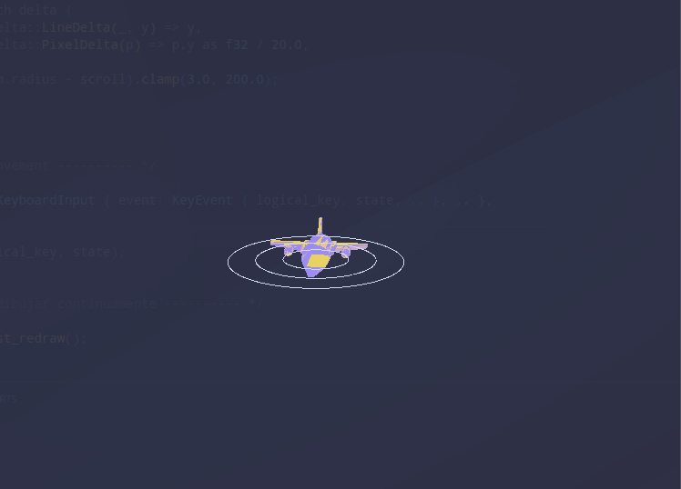
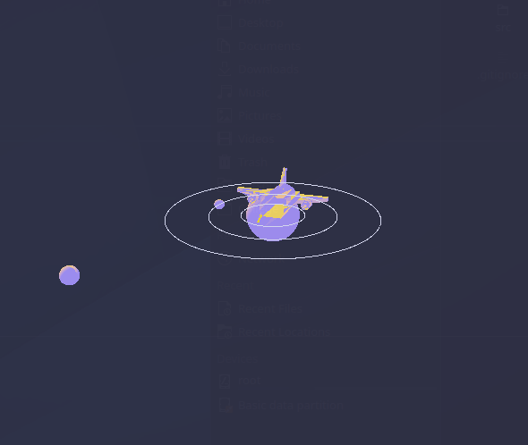
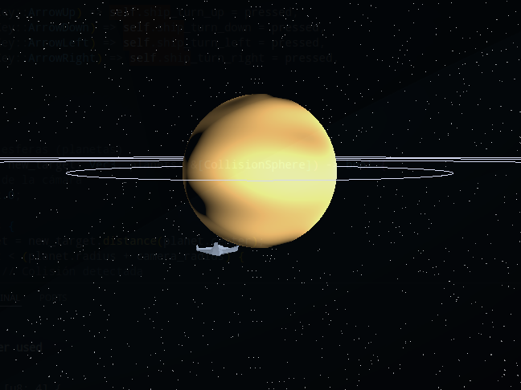
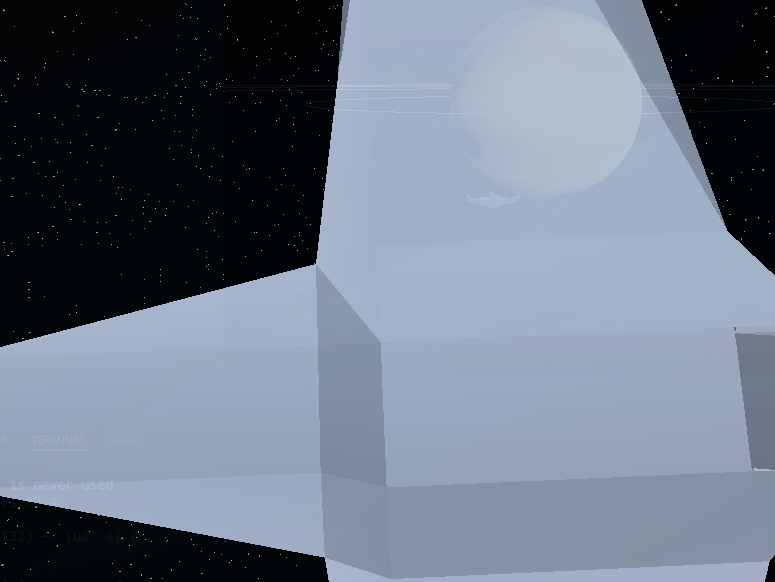

# Gráficas Por Computadora - Proyecto 3

+ Ana Laura Tschen 226145

### Descripción
El proyecto consiste en realizar una simulación del sistema solar utilizando un software renderer. El sistema solar contiene varios planetas y un sol.

### Tecnologías Utilizadas
+ Rust
+ wgpu 

### Video demostrativo

### Capturas de pantalla
Primera version del render

Segunda version del render

Tercera version del render

 

Cuarta version del render
